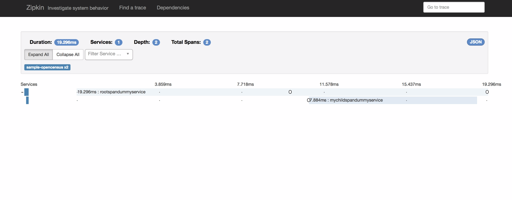
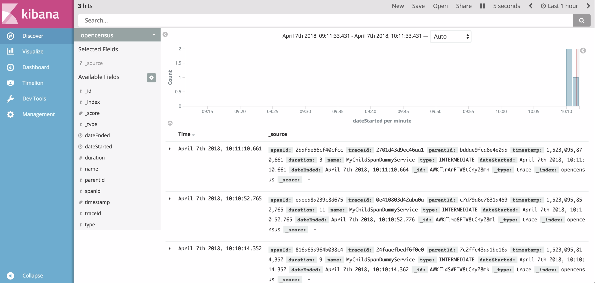
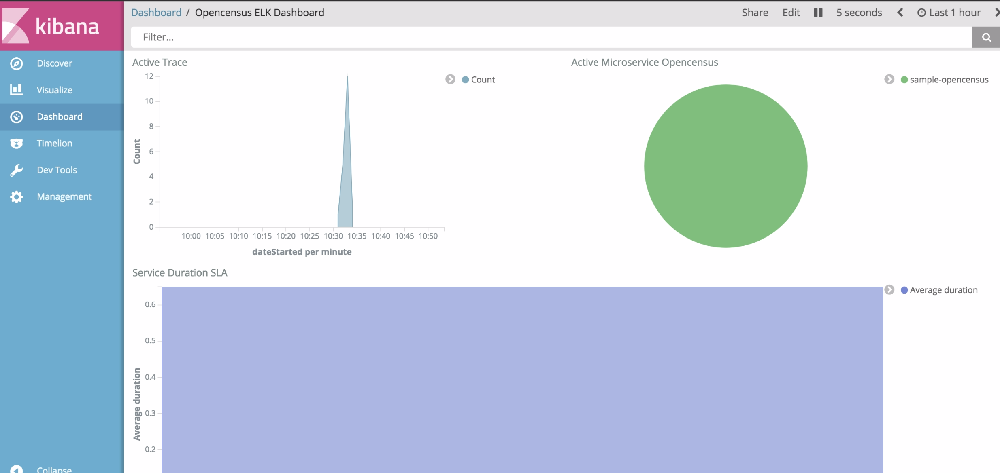

# distributed-tracing

Sample distributed tracing project that uses Opencensus.

This project shows how to export trace data to Zipkin and Elasticsearch.
It is based on the _'helloword'_  example from
[Opencensus repo](https://github.com/census-instrumentation/opencensus-java/tree/master/examples/src/main/java/io/opencensus/examples/helloworld).

## Note

### Zipkin Configuration

private final static String MICROSERVICE= "sample-opencensus";

    <dependency>
          <groupId>io.opencensus</groupId>
          <artifactId>opencensus-exporter-trace-zipkin</artifactId>
          <version>0.12.2</version>
        </dependency>

With a simple configuration like :

    private final static String MICROSERVICE= "sample-opencensus";
    private final static String ZIPKIN_URL= "http://localhost:9411/api/v2/spans";

    ZipkinTraceExporter.createAndRegister(ZIPKIN_URL,MICROSERVICE);

Traces can be sent to Zipkin. The current project supports Zipkin V2 API.

Read more on using Opencensus with Zipkin [here](https://github.com/census-instrumentation/opencensus-java/tree/master/exporters/trace/zipkin)

##### Discovering Trace on Zipkin

### ELK Configuration

To use Opencensus to export to Elasticsearch requires

      <dependency>
            <groupId>io.opencensus</groupId>
            <artifactId>opencensus-exporter-trace-elasticsearch</artifactId>
            <version>${opencensus.elasticsearch.exporter.version}</version>
          </dependency>

This is an Elasticsearch exporter I wrote for Opencensus. Specify your Elasticsearch configuration

    private final static String ELASTIC_SEARCH_URL= "http://localhost:9200";
      private final static String INDEX_FOR_TRACE= "opencensus";
      private final static String TYPE_FOR_TRACE= "trace";
      private final static String MICROSERVICE= "sample-opencensus";

    ElasticsearchConfiguration elasticsearchConfiguration
            = new ElasticsearchConfiguration(MICROSERVICE,null, null,ELASTIC_SEARCH_URL,
            INDEX_FOR_TRACE,TYPE_FOR_TRACE);
    ElasticsearchTraceExporter.createAndRegister(elasticsearchConfiguration);

 ..and trace

##### Discovering trace on kibana

To visualize test trace data in Elasticsearch with Kibana, I've created a sample dashboard as well as a screenshot
to see all trace event from Kibana discovery page.

A sample dashboard of trace data

 