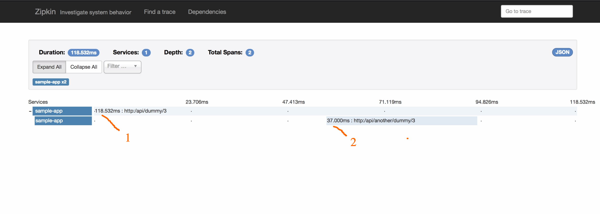
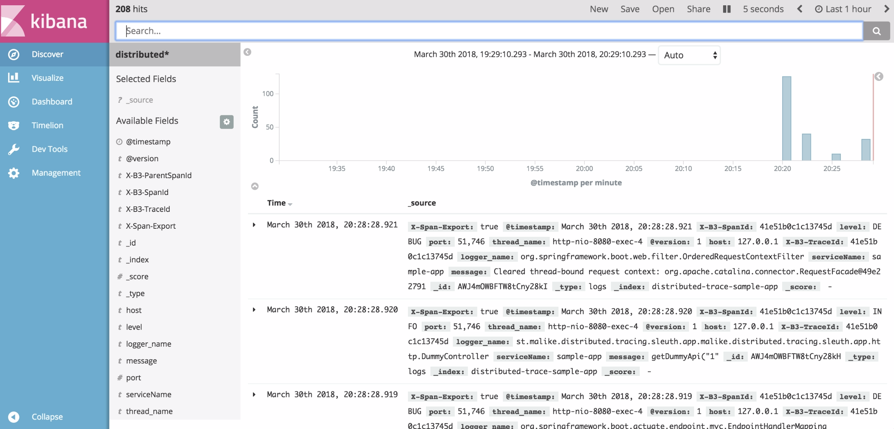

# distributed-tracing

A sample distributed tracing project that uses Spring Cloud Sleuth
that uses Logstash to export trace data to Elasticsearch and can also
be configured to send to Zipkin.

## Note

##### Zipkin Configuration

`spring.application.name=sample-app` add this to your application for
 Zipkin to identify the microservice. With out this it would tag the
 microservices as _"Unknown"_. You can change _"sample-app"_ to the identity
 of your microservice.

 `spring.zipkin.baseUrl=http://localhost:9411` This is responsible for pointing
 the microservice to Zipkin to successfully send trace events.

##### Discovering Trace on Zipkin

`curl http://localhost:8080/api/dummy/1` would generate trace for dummy service
 Unfortunately since this is not a communication between microservices you'll only see one
 span per trace.

 If you look at the codes you'll notice there's this funny part of it where I make
 another rest call to this api `http://localhost:8080/api/another/dummy/3`. This is to simulate
 a trace having two spans with the first one being `http://localhost:8080/api/dummy/1`
 and the second `http://localhost:8080/api/another/dummy/3`

 Zipkin would be running on this link [http://localhost:9411/](http://localhost:9411/)

##### ELK Configuration

For the ELK we'll need logback together with our ELK stack. By shipping the logs to Elasticsearch via
Logback we can visualize the trace.

By using the logging pattern `logging.pattern.console="%clr(%d{yyyy-MM-dd HH:mm:ss}){faint} %clr(${LOG_LEVEL_PATTERN:-%5p}) %clr([${springAppName:-},%X{X-B3-TraceId:-},%X{X-B3-SpanId:-},%X{X-Span-Export:-}]){yellow} %clr(${PID:- }){magenta} %clr(---){faint} %clr([%15.15t]){faint} %clr(%-40.40logger{39}){cyan} %clr(:){faint} %m%n${LOG_EXCEPTION_CONVERSION_WORD:-%wEx}"`
and logback config to ship to logstash. Trace data is sent to with elasticsearch and with the microservice
name as part of each trace data.

Logstash is started with a simple input output configuration
   `./logstash -e 'input { tcp { port => 5000 codec => "json" } } output { elasticsearch { hosts => ["localhost"] index => "distributed-trace-%{serviceName}"}}'`

With each microservice storing data into it's own index of elasticsearch but preceding with `distributed-trace-` to enable
 us search accros indexes in elasticsearch and kibana.

 After adding `distributed*` index in kibana we can visualize trace data in kibana.

I created a sample data based on the trace data to show (near)real time requests,number of host and active
 microservices in the past hour on kibana. You can do more with the trace data in there if you know how to use kibana.

 